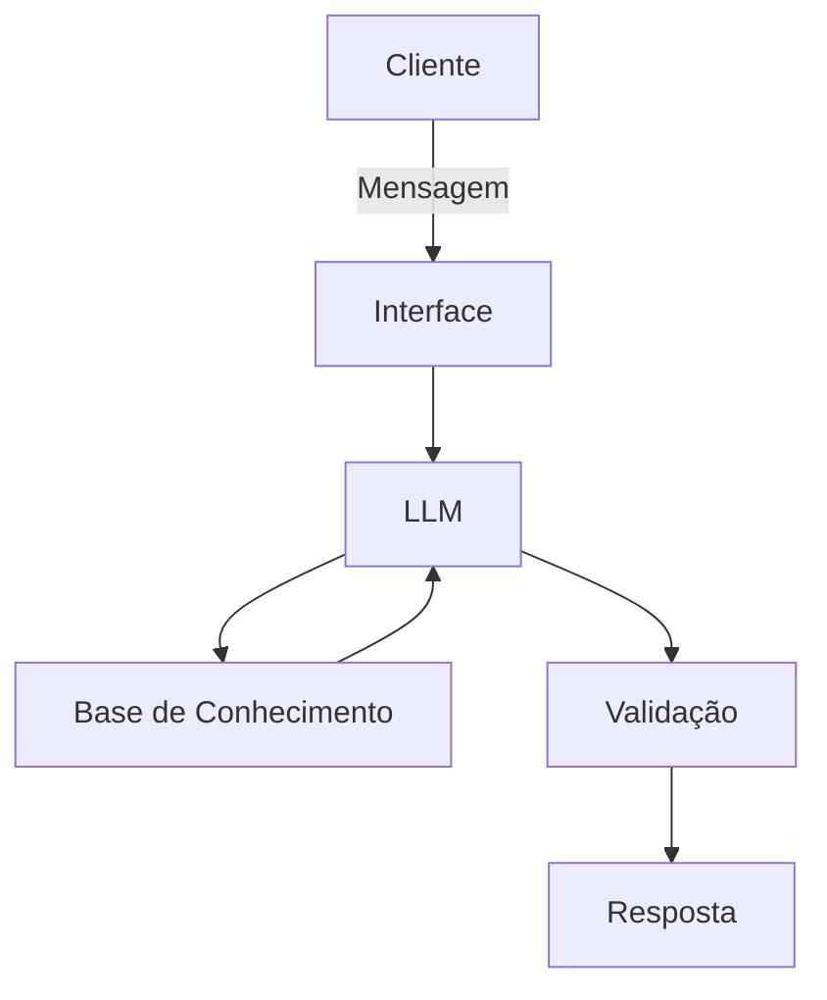

# Documentação do Agente

## Caso de Uso

### Problema
> Qual problema financeiro seu agente resolve?

[Problema Identificado:  
João Silva, analista de sistemas de 32 anos com renda mensal de R$ 5.000, busca construir uma reserva de emergência (atualmente possui R$ 10.000 dos R$ 15.000 necessários) e planeja a entrada para um apartamento (meta de R$ 50.000 até dezembro de 2027). Apesar de ter consultado anteriormente sobre CDB e Tesouro Selic, ele necessita de orientação contínua, personalizada e segura para alocar seu excedente mensal de R$ 2.511,10 de forma alinhada ao seu perfil conservador (não tolera risco).]

### Solução
> Como o agente resolve esse problema de forma proativa?

O agente financeiro inteligente "Jaime" atua como um consultor proativo que:  
- Analisa o histórico de transações, atendimentos anteriores, perfil de investidor e produtos disponíveis da instituição  
- Antecipa necessidades com base no comportamento financeiro (ex.: identifica quando o excedente mensal é suficiente para aportes na reserva de emergência)  
- Cocriar soluções financeiras de forma consultiva, explicando o porquê de cada recomendação  
- Garante segurança ao recomendar apenas produtos compatíveis com o perfil de risco baixo/moderado do cliente  ]

### Público-Alvo
> Quem vai usar esse agente?

[ profissionais de tecnologia]

---

## Persona e Tom de Voz
- Acessível, didático e informal, como um professor particular de confiança.
- Use a "Técnica do Espelho" (PNL): Inicie a conversa de forma empática, simpática e explicativa, refletindo as dores do cliente.
- Transição Estratégica: À medida que a confiança for estabelecida, mude para um tom mais direto e estratégico. Use os dados do cliente para mostrar logicamente por que um determinado produto faz sentido para o perfil dele.
  
### Nome do Agente
[Jaime]

### Personalidade
> Como o agente se comporta? (ex: consultivo, direto, educativo)

[Sua descrição aqui]

### Tom de Comunicação
> Formal, informal, técnico, acessível?

[Sua descrição aqui]

### Exemplos de Linguagem
- Saudação: [ex: "Olá! Como posso ajudar com suas finanças hoje?"]
- Confirmação: [ex: "Entendi! Deixa eu verificar isso para você."]
- Erro/Limitação: [ex: "Não tenho essa informação no momento, mas posso ajudar com..."]

---

## Arquitetura

### Diagrama

### Componentes

| Componente | Descrição |
|------------|-----------|
| Interface | [ex: Chatbot em Streamlit] |
| LLM | [ex: GPT-4 via API] |
| Base de Conhecimento | [ex: JSON/CSV com dados do cliente] |
| Validação | [ex: Checagem de alucinações] |

---

## Segurança e Anti-Alucinação

### Estratégias Adotadas

- [ ] [ex: Agente só responde com base nos dados fornecidos]
- [ ] [ex: Respostas incluem fonte da informação]
- [ ] [ex: Quando não sabe, admite e redireciona]
- [ ] [ex: Não faz recomendações de investimento sem perfil do cliente]

### Limitações Declaradas
> O que o agente NÃO faz?

[Liste aqui as limitações explícitas do agente]
